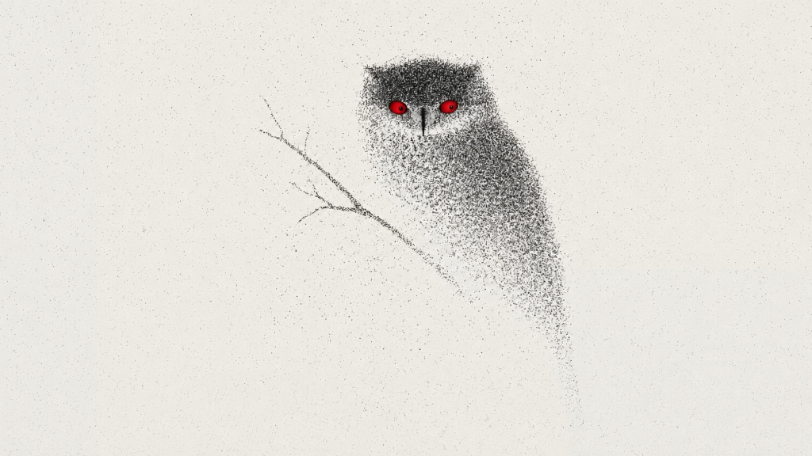

# 🦉 Tracking Owl

An interactive web experience where a beautiful stippled ink-wash owl artwork tracks your cursor with its vivid red eyes in real time.



## ✨ Features

- **Precision Eye Tracking** — Dual independent eyeballs with binocular convergence, 3D spherical foreshortening, and smooth physics-based lerp interpolation
- **Organic Behavior** — Natural periodic blinking, micro-saccades, pupil dilation in the dark, and subtle 3D head parallax tilt
- **Laser Prey Mode** — Toggle a glowing red laser dot with trailing spark particles that the owl intensely stalks
- **Night / Flashlight Mode** — Atmospheric dark mode where your cursor becomes a lantern beam and the owl's eyes glow with eerie red eye-shine
- **Atmospheric Audio** — Web Audio API synthesized ambient forest breeze and authentic multi-harmonic owl calls (on by default)
- **Touch Support** — Full touch-drag tracking for mobile and tablet devices
- **Responsive & Centered** — The owl scales and centers on any screen size from mobile to 4K ultrawide

## 🚀 Quick Start

1. Clone the repository:
   ```bash
   git clone https://github.com/Rahul-Gembali/Tracking-Owl.git
   cd Tracking-Owl
   ```

2. Start any local server:
   ```bash
   python -m http.server 8080
   ```

3. Open [http://localhost:8080](http://localhost:8080) in your browser

4. Move your mouse and watch the owl track you! 🦉

## 🎮 Controls

| Button | Action |
|--------|--------|
| **Laser Dot** | Toggle glowing red prey target with particle trail |
| **Night Mode** | Toggle dark flashlight/lantern mode |
| **Blink** | Trigger an instant owl blink + hoot |
| **Sound** | Toggle ambient forest breeze & owl calls |
| **Fullscreen** | Enter/exit fullscreen view |

## 🗂 Project Structure

```
├── index.html           # Responsive page layout & UI controls
├── styles.css           # Paper texture styling, night mode, controls dock
├── app.js               # Gaze tracking engine, eye physics, audio synthesis
├── assets/
│   ├── owl_clean.png    # Cleaned stippled owl artwork
│   ├── owl_cutout.png   # Transparent eye socket feather overlay
│   └── paper_tile.jpg   # Seamless background paper texture
└── scripts/
    └── prepare_assets.py  # Python asset generation pipeline (PIL)
```

## 🛠 How It Works

The artwork is composited in two layers:
1. **Canvas Layer** (behind) — Renders the dynamic red iris with procedural pointillism texture, moving pupil with spherical foreshortening, specular glints, and animated eyelids
2. **Image Overlay** (in front) — The original stippled feathers with transparent eye sockets, so the dynamic eyeballs sit naturally *underneath* the hand-drawn feather borders

Eye positions are calculated using `atan2` angles and `tanh` sigmoid distance curves, with binocular convergence when the cursor approaches the beak midline.

## 📜 License

MIT License — feel free to use, modify, and share.

---

*Built with vanilla HTML, CSS, JavaScript & Canvas — no frameworks, no dependencies.*
